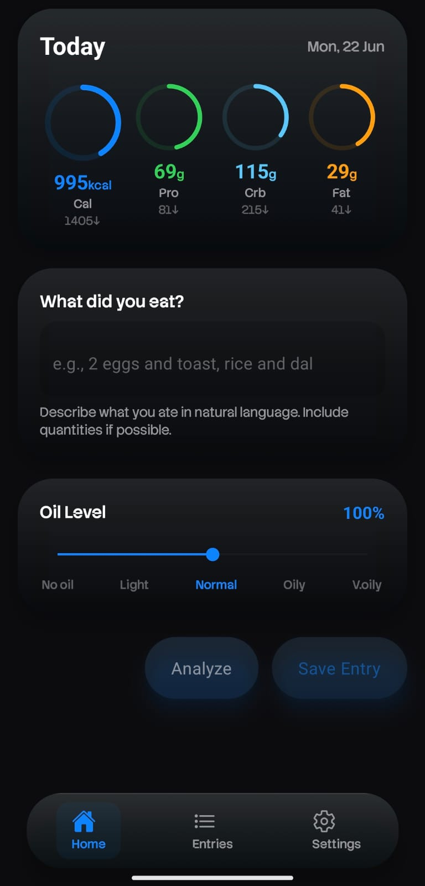
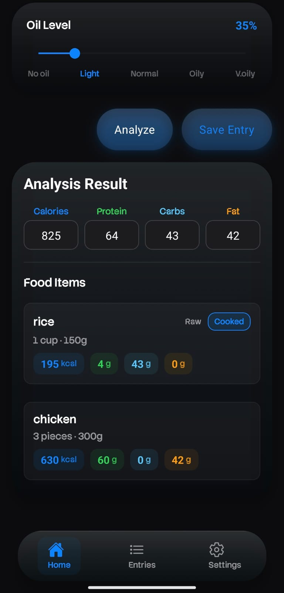
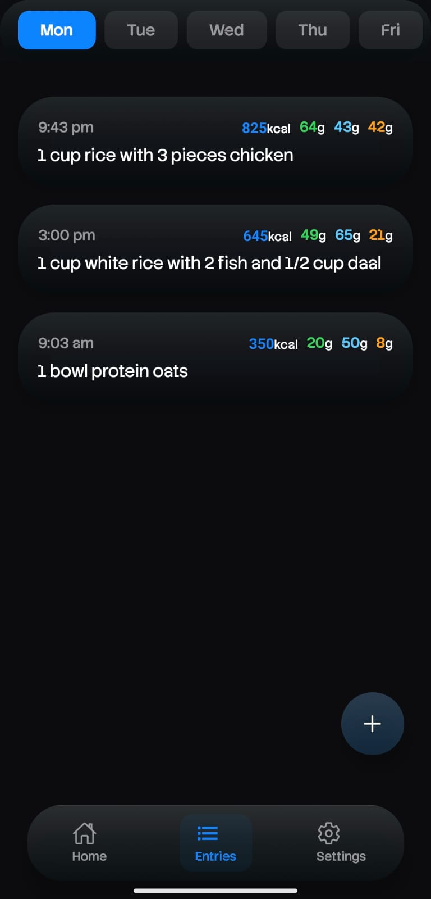

# JC

A text-first calorie and macro tracking app that lets users log meals naturally without searching food databases or manually entering nutrition data.

Users simply describe what they ate, and JC estimates calories, protein, carbohydrates, and fats automatically. Built with Indian eating habits in mind, JC understands regional foods, home-cooked meals, and everyday descriptions such as "2 rotis with chicken curry" or "4 pieces of chicken".

## Features

* Natural language food logging
* Automatic calorie and macro estimation
* Portion size estimation from everyday descriptions
* Indian and regional food support
* Adjustable oil usage estimation
* Daily calorie and macro tracking
* Local-first data storage
* No account or sign-up required
* Fast and minimal user experience

## Screenshots

<p align="center">
  
  
  
</p>

## Download

Download the latest Android APK from the Releases section.

## Example Inputs

* 2 rotis with chicken curry
* 300g boiled chicken
* 1 bowl rice and dal
* 4 pieces of fish fry
* 2 eggs and a banana

## Tech Stack

* React Native
* Expo
* TypeScript
* Gemini API
* Local Device Storage

## Installation

```bash
git clone https://github.com/SUNNY20052006/JC-calories-tracker.git
cd JC-calories-tracker.git
npm install
npx expo start
```

## Roadmap

* Improved food estimation accuracy
* Voice food logging
* Better Indian food database
* Weekly nutrition insights
* Meal history analytics

## License

MIT License
